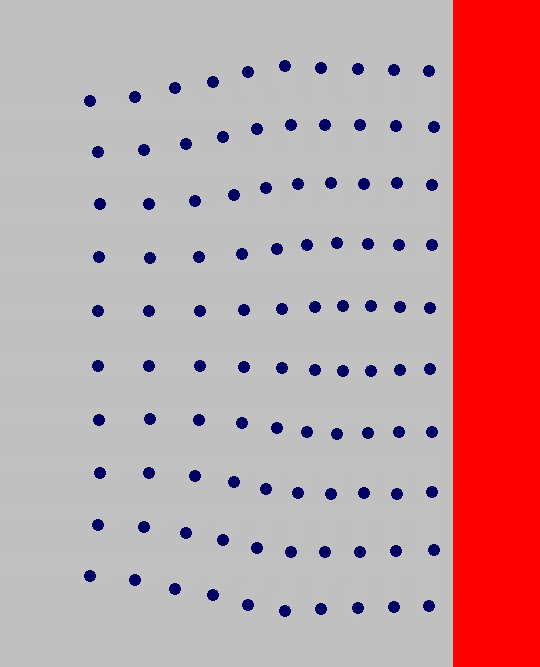

# Elastic-Solid-Simulator
This is a physics engine simulating collision of a soft-body with a rigid wall. The constituent particles are bonded together with spring forces. There is also an
internal damping between them. Internal as well as external collision has been implemented.
The implementation is in FLTK, and given the limitations of the library, the simulation can run only at 10 frames/second. Future versions may use OpenGL and more
complex behaviour can be implemented.

## Images
Some images from the simulator, showing collision and harmonic oscillation

| Collision against rigid body | Harmonic oscillations |
| --- | --- |
|  |  |

## Installation
### For Linux 
Install g++ on your device and add its path to the environment variable. Install fltk:
```
sudo apt-get install libfltk1.3
```
Clone the repository and open terminal in the workind directory. Run the simulation using
```
fltk-config --compile Solid.cpp
```
```
./Solid
```
